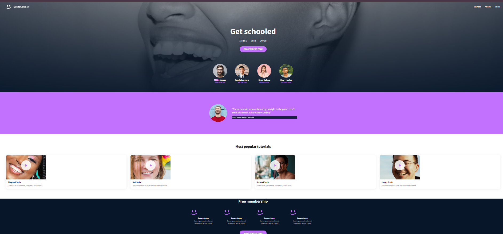

📌 Overview
Smiles is a simple, uplifting webpage designed to brighten the reader’s day by exploring the beauty, meaning, and impact of a smile. The project focuses on positivity, clean design, and an inviting user experience.
🎯 Purpose
The goal of this webpage is to:
Celebrate the universal language of smiles
Provide a warm and friendly web experience
Encourage users to spread joy
Act as a simple HTML/CSS practice or showcase project
🛠️ Technologies Used
HTML5
CSS3
(Optional) JavaScript for animations or interactions

📁 Project Structure

project-folder/

│

├── index.html        # Main webpage

├── styles.css        # Styling for the page

└── images/           # Any smile-related images (optional)

✨ Features
Clean and minimal interface
Inspiring text about smiles
Optional hero image or illustration
Responsive design (if implemented)
Smooth typography and simple color palette

🚀 How to Use
Clone or download the project folder.
Open index.html in any browser.
Customize the text, images, or colors as needed.

👩‍🎨 Customization Ideas

Add quotes about smiling

Insert real photos or icons of smiling faces

Include animations or hover effects

Build a themed color palette (yellow, orange, warm tones)

🤝 Contribution
Feel free to fork this project, make improvements, and submit pull requests—especially if you want to add more content that spreads joy!

📜 License
This project is open-source and available under the MIT License.

